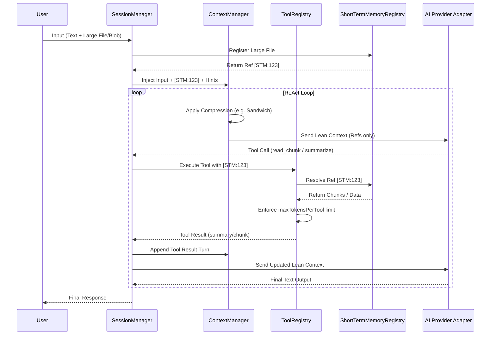

# Lemura: Developer Guide & Architecture

This document provides a deep dive into the internal architecture, advanced execution techniques, and memory management systems of the Lemura agentic AI runtime. For basic setup and quick start, refer to the [README.md](./README.md).

---

## 🛠️ Advanced Features

Lemura goes beyond basic LLM orchestration with these enterprise-grade features:

- **Short Term Memory (STM)**: A dynamic registry for session variables (large texts, PDFs, images) that avoids context bloat.
- **Pluggable Storage Abstraction**: Choose where to store session data (In-Memory, LocalStorage, Supabase, etc.).
- **Sandwich Compression Pipeline**: A 3-layer summarization strategy (Pre-Layer, Core Layer, Post-Layer) for massive documents.
- **Workflow Orchestration**: Fine-tuned ReAct loop with per-tool token limits and scratchpad synchronization.
- **Skill Injection**: Behavioral guidance via YAML/Markdown manifests injected at granular lifecycle positions.

---

## 🧠 Memory Management

Lemura handles heavy content and long-running conversations through a dedicated memory subsystem.

### Short Term Memory (STM) Registry
The `ShortTermMemoryRegistry` manages assets that are too large to fit in a single prompt. It converts these assets into lean references like `[STM:uuid]`.

- **Text Management**: Enforces configurable token limits.
- **Blob Support**: Handles arbitrary binary data (Images, Audio, PDF) without size limits.
- **Recursive Retrieval**: The agent can "drill down" into memory items using specific tools.

### Storage Abstraction (`IStorageAdapter`)
Users can configure the storage backend for STM:
```ts
export interface IStorageAdapter {
  get(id: string): Promise<any>;
  set(id: string | undefined, content: any, metadata?: any): Promise<string>;
  delete(id: string): Promise<void>;
}
```
Available implementations: `InMemoryStorageAdapter` (built-in).

---

## ⚙️ Workflow & The Agentic Loop

Lemura's core is a **ReAct (Reasoning + Acting) Loop**. It handles the synchronization of the LLM's thought process with external tools and its own "scratchpad" memory.

### Updated Agentic Workflow Diagram



### Essential Components

| Component          | Role in Agentic AI Management                                                                 |
|--------------------|-----------------------------------------------------------------------------------------------|
| **SessionManager** | Core orchestrator; runs ReAct loop, enforces tool limits, syncs scratchpad. |
| **ContextManager** | Manages conversation history; applies compression strategies (History, Sandwich, MaxTokens). |
| **STMRegistry**    | Manages heavy assets; provides stable ID references to prevent context overflow. |
| **ToolRegistry**   | Registers and executes tools. Built-in tools for STM: `read_chunk`, `search_chunk`, `update_chunk`. |
| **IProviderAdapter**| Abstracts LLM calls; ensures zero lock-in for model providers. |

---

## 🛠️ Built-in Memory Tools

Lemura adds several built-in tools when a `ShortTermMemoryRegistry` is configured:

| Tool | Description |
|---|---|
| `read_chunk` | Reads a specific byte/char range from an STM reference. |
| `search_chunk` | Performs keyword search within a large memory item. |
| `list_chunks` | Returns the structural breakdown (indices) of an STM item. |
| `update_chunk` | Appends or modifies content in an existing memory item. |
| `read_scratchpad` | Accesses the agent's internal reasoning scratchpad. |
| `write_scratchpad` | Updates the scratchpad for multi-turn reasoning steps. |
| `summarize_sandwich`| Generates a 3-layer summary (Pre/Core/Post) for a memory ref. |

---

## 🏗️ Technical Implementation Details

### Sandwich Compression Strategy
The sandwich strategy implements a 3-layer summarization pipeline:
1.  **Pre-Layer (Encoding)**: Maps internal chunks to semantic anchors.
2.  **Core Layer (Processing)**: Dense summary generated via LLM instructions.
3.  **Post-Layer (Decoding)**: Provides refinement cues and tool-access hooks for the agent.

### Token Limit Enforcement
- **`maxTokensPerTool`**: Prevents a single tool output from hijacking the entire context window.
- **`maxTokensPerCall`**: Ensures multi-turn conversations stay within provider physical limits.

---

## 🤝 Contributing & Roadmap

Refer to the [Internal Rules](./.cursor/rules/Project.md) for contribution guidelines.
Roadmap:
- [ ] Supabase/LocalStorage adapters.
- [ ] Sequential tool continuation planning.
- [ ] Multimodal vision-to-STM mapping.