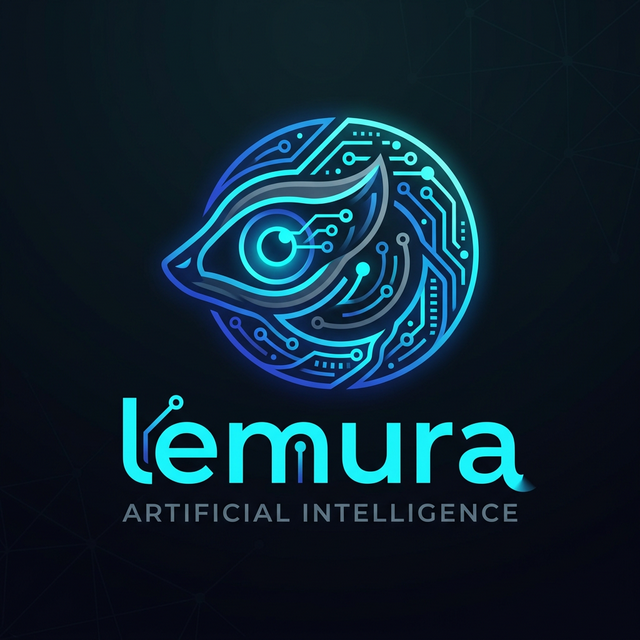

<align="center">
  
</align>

# lemura

**A provider-agnostic, premium agentic AI runtime for the modern web.**

[](https://www.npmjs.com/package/lemura)
[](https://github.com/rzafiamy/lemura/lemura/blob/main/LICENSE)
[](https://github.com/rzafiamy/lemura/lemura/actions)
[](https://codecov.io/gh/lemura-ai/lemura)

---

`lemura` is a robust, provider-agnostic npm package designed to encapsulate a full agentic AI runtime. It simplifies the complex orchestration of LLMs, tools, and context management into a single, cohesive interface.

## 🚀 Install

```bash
pnpm add lemura
# or
npm install lemura
```

## ⚙️ Environment Variables

The built-in `OpenAICompatibleAdapter` can be configured using environment variables. To load them from a `.env` file in Node.js, you'll typically need a library like `dotenv`:

```bash
npm install dotenv
```

Then at the very top of your entry point:

```ts
import 'dotenv/config';
```

Create a `.env` file in your project root:

```ini
# Provider Configuration (OpenAI, Groq, Together, Ollama, etc.)
LEMURA_API_KEY=your_api_key_here
LEMURA_BASE_URL=https://api.openai.com/v1
LEMURA_MODEL=gpt-4o-mini

# Fallbacks (Lemura also checks standard OpenAI variables)
OPENAI_API_KEY=your_api_key_here
OPENAI_BASE_URL=https://api.openai.com/v1
OPENAI_MODEL=gpt-4o-mini
```

## ⚡ Quick Start

```ts
import { SessionManager, OpenAICompatibleAdapter } from 'lemura';

async function main() {
  const adapter = new OpenAICompatibleAdapter({
    baseUrl: 'https://api.openai.com/v1',
    apiKey: process.env.OPENAI_API_KEY || '',
    defaultModel: 'gpt-4o-mini'
  });

  const session = new SessionManager({
    adapter,
    model: 'gpt-4o-mini',
    maxTokens: 100000,
  });

  const response = await session.run('What is lemura?');
  console.log(response);
}

main();
```

## 🧠 Core Concepts

Explore the architecture and advanced capabilities of `lemura`:

- 🏁 [**Getting Started**](./docs/guides/getting-started.md) — Fundamental setup and concepts.
- 🧹 [**Context Management**](./docs/guides/context-management.md) — Advanced compression strategies.
- 🔌 [**Adapters**](./docs/guides/adapters.md) — Connecting to OpenAI, Groq, Anthropic, and more.
- 🛠️ [**Tools and Skills**](./docs/guides/tools-and-skills.md) — Extending agent capabilities.
- ⚡ [**Advanced Execution**](./docs/guides/advanced-execution.md) — Goal planning and continuation.

## 📦 API Overview

| Export | Description |
|---|---|
| `SessionManager` | The main entry point orchestrating the ReAct loop and tools. |
| `ContextManager` | Manages the conversation history using compression strategies. |
| `OpenAICompatibleAdapter` | Reference adapter for OpenAI, Groq, Together, etc. |
| `ToolRegistry` | Registers and executes tools for the agent. |
| `SkillInjector` | Loads and formats YAML/Markdown skills into system prompts. |
| `DefaultLogger` | Colorized logger with Problem/Hints metadata support. |

## 🪵 Logging and Tracing

`lemura` features a premium, structured logging system designed for developer experience. It provides colorized output and actionable hints for errors.

```ts
import { SessionManager, DefaultLogger, LogLevel } from 'lemura';

const logger = new DefaultLogger();
logger.setLevel(LogLevel.DEBUG); // Set to show trace-level information

const session = new SessionManager({
  adapter,
  model: 'gpt-4o-mini',
  maxTokens: 100000,
  logger: logger // Inject the logger
});
```

When an error occurs (like an invalid API key), `lemura` provides beautiful, structured feedback:

```text
2026-03-07T13:05:49.686Z [FATAL] Provider call failed: HTTP 401: Unauthorized
  PROBLEM: Authentication failed. The API key is invalid or missing.
  HINTS:
    - Ensure your API key is correctly configured in the adapter or environment variables.
    - Check if the API key has expired or been revoked.
```

## 🔌 Provider Adapters

`lemura` interacts with LLMs exclusively through the `IProviderAdapter` interface, ensuring zero lock-in.

| Adapter | Status | Description |
|---|---|---|
| `OpenAICompatibleAdapter` | ✅ Built-in | Wrapper for OpenAI and API-compatible endpoints. |

> [!TIP]
> To write a custom adapter for another provider, see the [Custom Adapter Recipe](./docs/recipes/custom-adapter.md).

## 🤝 Contributing

We welcome contributions! Please read our [Internal Rules](./.cursor/rules/Project.md) and [Documentation Guidelines](./.cursor/rules/Documentation.md) before submitting a PR.

## 📄 License

Distributed under the **MIT License**. See `LICENSE` for more information.
