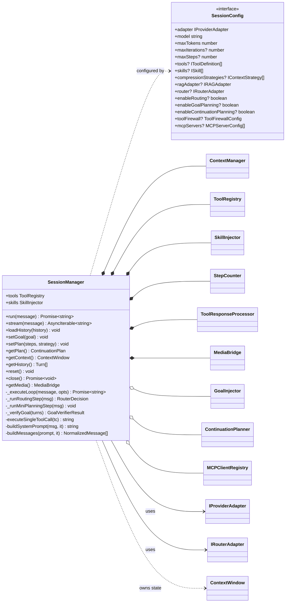
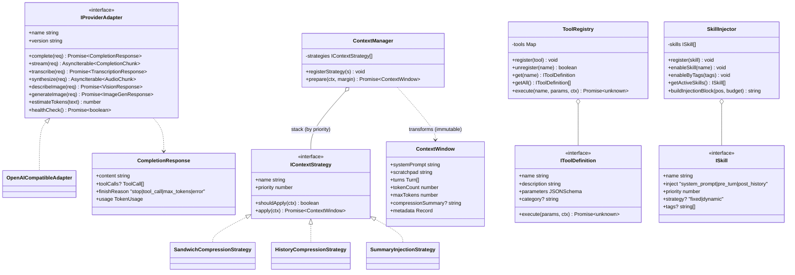
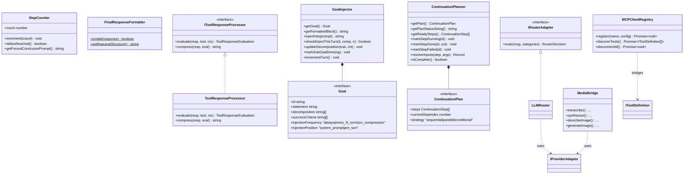

# Class Diagram

## What this is

The structural view of the lemura runtime: the classes and interfaces that make up a
session, and how they relate. `SessionManager` is the composition root — it owns one
each of the core collaborators and orchestrates them through the ReAct loop.

Signatures below are simplified (key members only) but match the real source. The
authoritative definitions live in [`src/types/`](../../src/types/) and the
implementations under [`src/`](../../src/).

---

## Core composition

> `*--` = composition (created and owned for the session's lifetime).
> `o--` = aggregation (optional, created on demand / from config).
> `-->` = dependency via interface.

---

## Provider, context & tooling layer

---

## Advanced execution helpers

---

## Notes on key relationships

- **`SessionManager` is the only orchestrator.** Everything else is a focused
  collaborator it composes — there is no separate `ReActAgent` class.
- **`ContextManager` is immutable in/out.** `prepare()` returns a *new* `ContextWindow`;
  strategies never mutate their input (see [Context-management rules](../../.agent/rules/Context-management.md)).
- **Tools, skills, strategies, adapters, and the router are all interface-typed**, so
  consumers can supply custom implementations — the core stays provider-agnostic
  ([Project rules](../../.agent/rules/Project.md)).
- **MCP tools are bridged into the same `ToolRegistry`** as native tools, so the loop
  treats them uniformly.

---

## See also

- [Use case diagram](use-case-diagram.md) — who uses these classes and why.
- [Sequence diagram](sequence-diagram.md) — how these objects collaborate over time.
- [Request flow](request-flow.md) — the staged narrative of a request.
