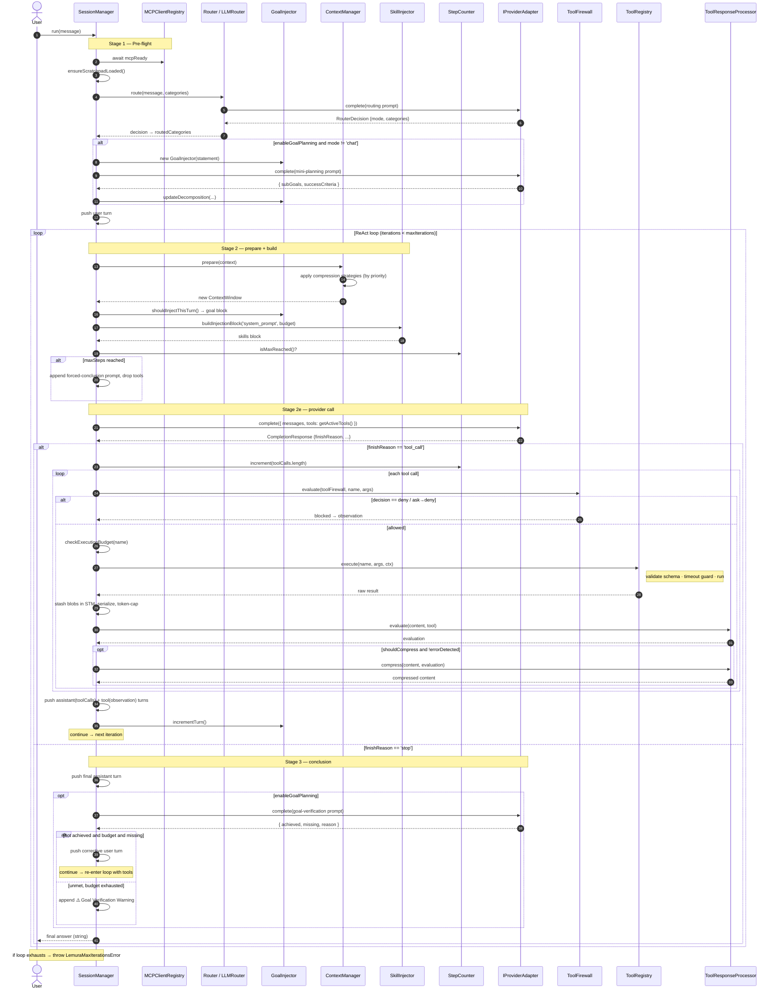
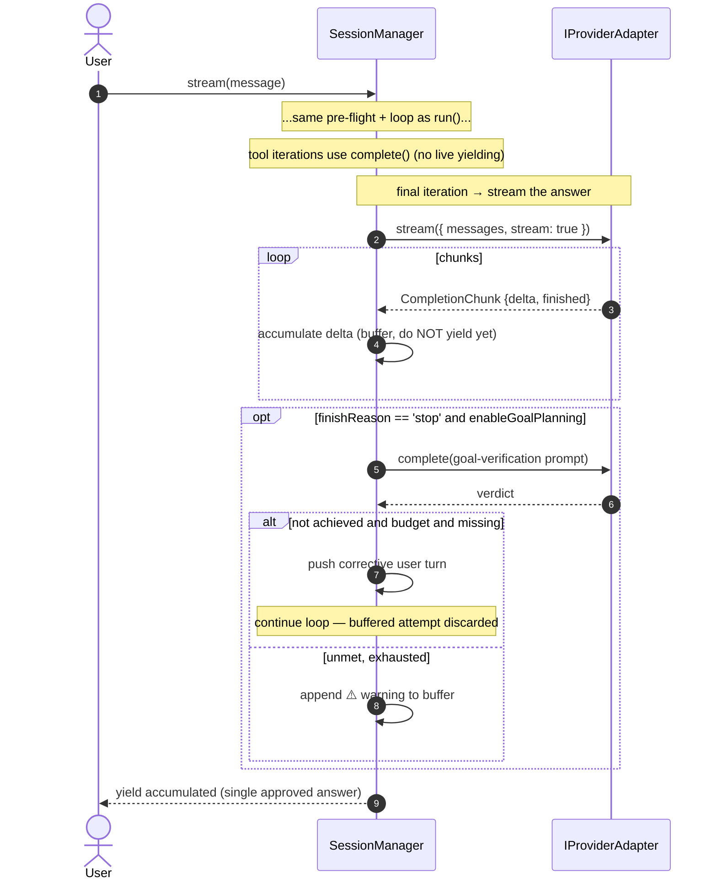

# Sequence Diagram

## What this is

The temporal view of a single request: the exact order of messages exchanged between
`SessionManager` and its collaborators from `run(message)` to the returned answer. It
mirrors the stages in [request-flow.md](request-flow.md), but as interaction sequences.

Two diagrams are provided:
1. **Full `run()`** — the complete ReAct loop including a tool round and goal
   verification.
2. **`stream()` differences** — how streaming buffers the final answer before yielding.

---

## 1. Full `run()` — tool round + goal verification

---

## 2. How `stream()` differs

`stream()` follows the same pipeline, but the **final** assistant message is produced
via `adapter.stream()` and **buffered** — goal verification runs on the buffered text so
a rejected/corrected attempt is never surfaced. Only the single approved answer is
yielded.

---

## Reading notes

- **Two extra LLM calls are common per task turn** beyond the main loop: one for
  **routing** and one for **mini-planning** (only when `enableGoalPlanning`), plus one
  for **goal verification** at the end. A `chat`-mode route skips planning and
  verification entirely.
- **Compression runs every iteration** via `ContextManager.prepare()` — it is a no-op
  unless a strategy's `shouldApply()` returns true.
- **Tool errors are never swallowed** — they are pushed back as `tool`-role
  observations so the model can react on the next iteration.
- **`maxSteps` vs `maxIterations`**: the `StepCounter` counts individual tool calls and
  forces a graceful conclusion (tools dropped) when exceeded; `maxIterations` bounds the
  whole loop and throws `LemuraMaxIterationsError` if hit without a final answer.

---

## See also

- [Request flow](request-flow.md) — the same pipeline as a stage-by-stage narrative.
- [Class diagram](class-diagram.md) — the objects participating above.
- [Use case diagram](use-case-diagram.md) — the actors and goals behind a request.
