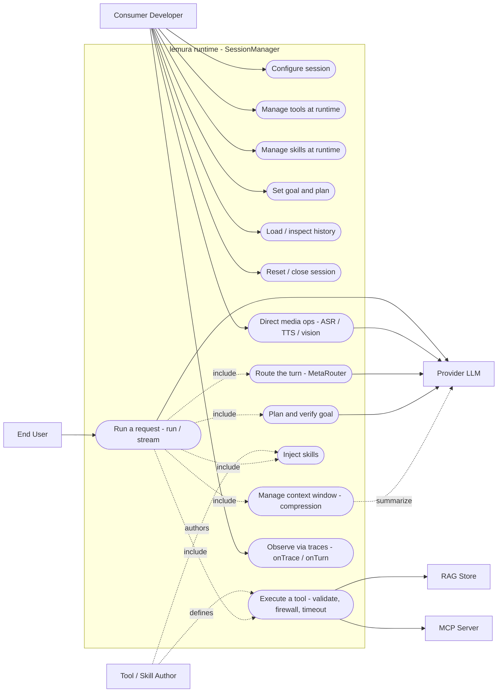

# Use Case Diagram

## What this is

The use case view of lemura — **who** interacts with the runtime and **what** they can
accomplish. lemura is a library, so its "actors" are the developer integrating it, the
end user whose messages flow through a session, and the external systems the runtime
talks to (the LLM provider, RAG store, and MCP servers).

The use cases below map to real public API surface on
[`SessionManager`](../../src/agent/SessionManager.ts) and the adapter interfaces.

---

## Actors

| Actor | Role |
|---|---|
| **Consumer Developer** | Configures and drives a `SessionManager` from application code. |
| **End User** | Sends messages that the consumer app forwards to `session.run()` / `stream()`. |
| **Provider (LLM)** | `IProviderAdapter` — completion, streaming, ASR/TTS/vision/image-gen. |
| **RAG Store** | `IRAGAdapter` — ingest & query (optional). |
| **MCP Server** | External tool servers bridged via `MCPClientRegistry` (optional). |
| **Tool / Skill Author** | Defines `IToolDefinition`s and skill markdown consumed by a session. |

---

## Diagram

---

## Use case briefs

### Driven by the Consumer Developer

- **Configure session** — build a `SessionConfig` (adapter, model, `maxTokens`, tools,
  skills, compression strategies, router, goal/continuation flags, MCP servers) and
  `new SessionManager(config)`.
- **Manage tools at runtime** — `session.tools.register()` / `unregister()` /
  `getAll()`.
- **Manage skills at runtime** — `session.skills.enableSkill()` / `disableSkill()` /
  `enableByTags()`.
- **Set goal & plan** — `session.setGoal(...)` and `session.setPlan(steps, strategy)`
  bypass the automatic mini-planning step.
- **Load / inspect history** — `loadHistory()`, `getHistory()`, `getContext()`,
  `getPlan()`.
- **Reset / close** — `reset()` clears conversation state; `close()` disconnects MCP
  servers.
- **Direct media ops** — `getMedia()` exposes ASR / TTS / vision / image-gen on the
  `MediaBridge`.
- **Observe** — supply `onTrace` / `onTurn` callbacks to watch the pipeline.

### Driven by the End User

- **Run a request** — the end user's message enters via `run()` or `stream()`. This is
  the umbrella use case that **includes** the internal pipeline below.

### Internal use cases (`<<include>>` of "Run a request")

- **Route the turn** — `MetaRouter`/`LLMRouter` narrows the tool surface and may mark a
  `chat` turn.
- **Manage context window** — `ContextManager` applies compression strategies before
  each provider call.
- **Inject skills** — `SkillInjector` adds skill content to the system prompt within a
  token budget.
- **Plan & verify goal** — `GoalInjector` mini-planning + post-answer verification.
- **Execute a tool** — schema-validate, firewall-check, timeout-guard, and run; talks
  to RAG / MCP when those tools are invoked.

---

## See also

- [Request flow](request-flow.md) — the staged pipeline these use cases run through.
- [Sequence diagram](sequence-diagram.md) — the temporal view of "Run a request".
- [Class diagram](class-diagram.md) — the structural view of the components.
